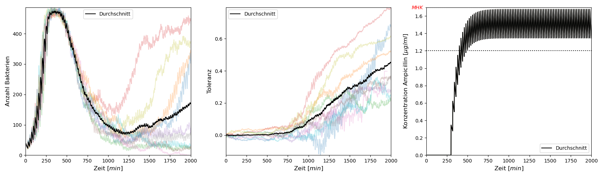

## WHAT IS IT?
Das Pythonscript startet NetLogo und simuliert mehrere Durchläufe mit ggf. unterschiedlichen Parametern.
Die Parameter werden über eine JSON-Datei übergeben.
Nach dem Simulieren wird das Ergebnis in eine CSV-Datei geschrieben und kann mit dem Script geplotted werden.

## HOW IT WORKS
Die JSON-Datei hat folgendes Format:
```
{"ticks": <Anzahl>, "n": <Anzahl>,
"setup": { "<Parameter>": <Wert>,
		...
	 },
"value": ["<Parameter>", <Wert1>, <Wert2>, ...]
}
```
Mit `ticks` wird die Anzahl der zu simulierenden Ticks angegeben und mit `n` die Anzahl der Durchläufe.
In der Liste `setup` werden jeweils Parameter und Wert Paare angegeben. Diese werden zu Beginn der Simulation gesetzt.
Der Parameter `value` definiert einen Paramter, der variert werden soll. Von jedem Wert werden `n` Durchläufe simuliert.

Das Script wird über die Kommandozeile gestartet und nimmt einen Modus (`s` zum simulieren und `p` zum plotten) und einen Pfad für die CSV-Datei als Argument entgegen.
Per Default sucht das Script unter `./model.nlogo` dem NetLogo-Modell und unter `./config.json` nach der Konfigurationsdatei.
Bei< Bedarf können diese Parameter mit `-m <path>` für das Modell und `-c <path>` für die Konfigurationsdatei gesetzt werden.
Zum Test können diese Befehle mit der angehangenen Konfigurationsdatei ausgeführt werden.
```
python simbacat.py s data -v
python simbacat.py p data
``` 
Dabei sollte ein Plot ähnlich zu diesem entstehen:


Weiterer SchnickSchnack kann der Dokumentation entnommen werden, welche mit `python simbacat.py -h` angezeigt werden kann.

## WHAT IT NEEDS
* python3
  * matplotlib
  * numpy
  * pynetlogo
* NetLogo

## WINDOWS...
Wir haben das Script unter Windows nicht zum laufen bekommen.
Die [Dokumentation](https://pynetlogo.readthedocs.io/en/latest/) gibt an man solle in Zeile 21 des Script einen JVM Pfad angeben und die Zeile 22 muss (mit Komma der vorherigen Zeile) auskommentiert werden.
